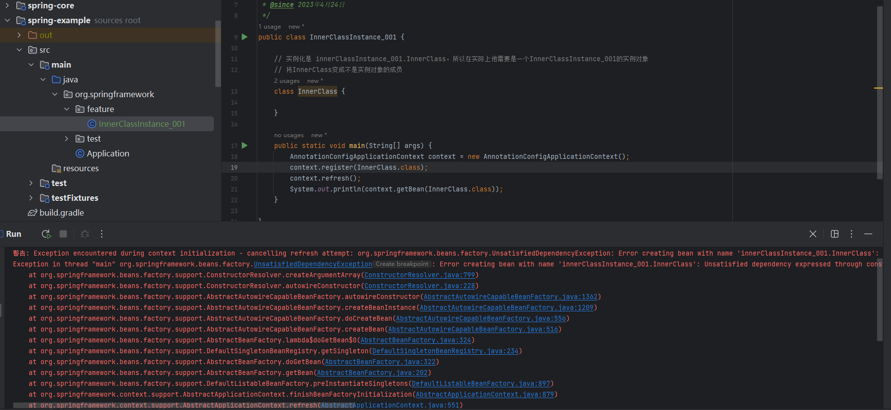

## 高级特性
### 内部类实例化
- org.springframework.feature.InnerClassInstance_001
****
**结论及过程分析**
1. 现象

2. 分析
- org.springframework.beans.factory.support.AbstractAutowireCapableBeanFactory.createBeanInstance: 创建bean实例的核心方法
- org.springframework.beans.factory.support.AbstractAutowireCapableBeanFactory.determineConstructorsFromBeanPostProcessors 从BeanPostProcessors推断构造函数，如果bean中没写构造函数就返回一个空
- org.springframework.beans.factory.support.SimpleInstantiationStrategy.instantiate(org.springframework.beans.factory.support.RootBeanDefinition, java.lang.String, org.springframework.beans.factory.BeanFactory) 获取默认的DeclaredConstructor
